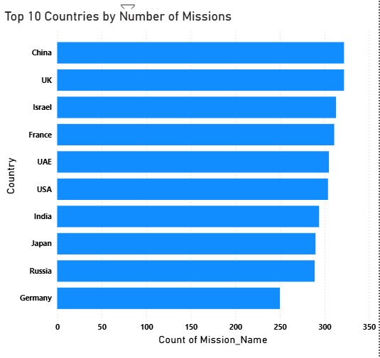
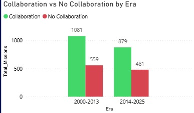
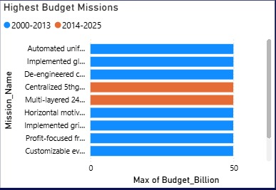
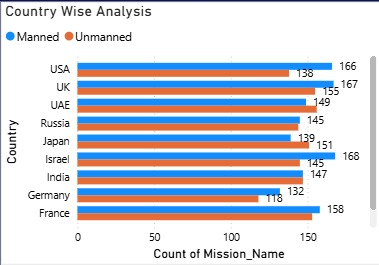

# 🚀 Space Mission Budget & Performance Analysis

This project uses **SQL + Power BI + Dataset** to study space missions.  
The focus is on answering:  
👉 *How do budget, mission type, duration, and collaboration affect mission success?*

---

## 📂 Project Files
- **powerbi.pbix** → Power BI Dashboard  
- **space_missions.sql** → SQL scripts (data cleaning + analysis)  
- **Global_Space_Exploration_Dataset.csv** → Dataset (CSV file)  
- **Images (.jpg)** → Dashboard screenshots and example charts  

---

## 📖 Storytelling with Dashboard

### 1. 🌍 Global Overview
- The first dashboard page shows **total missions, average budgets, and success rates**.  
- This gives a quick comparison of how different countries have contributed to space exploration.  
- Example: Some countries launch more missions with lower budgets, while others spend heavily but launch fewer missions.  

---

### 2. 💰 Budget vs Success
- The dashboard also analyzes **how budget impacts mission success**.  
- It shows that spending more does **not always guarantee success**.  
- This helps in finding the **real cost-to-success ratio** of missions.  

---

### 3. 🛰️ Mission Types & Durations
- Different mission types (Satellite Launch, Human Spaceflight, Scientific Missions, etc.) are compared.  
- **Insight:** Human space missions are generally costlier and take longer.  
- Satellite launches are faster and require smaller budgets.  

---

### 4. 🤝 Collaboration Impact
- Missions are divided into **Collaborative vs Non-Collaborative**.  
- **Finding:** Collaboration leads to a **higher success rate**.  
- This insight shows how international partnerships can reduce risks and improve outcomes.  

---

### 5. 🏳 Country Profiles
- Country-wise breakdown of missions shows:  
  - Which countries spend more on average  
  - Which achieve better success rates  
  - Which are more consistent in their missions  

---

## 🔑 Key Insights
- **Top countries** with the highest number of missions  
- **Highest budget missions** across different eras  
- **Manned vs Unmanned** mission trends by country  
- **Collaboration vs No Collaboration** → clear success difference  
- **Budget vs Success** → more money ≠ guaranteed success  

---

## ⚡ How to Use
1. Open `powerbi.pbix` in Power BI Desktop  
2. Run SQL queries in `space_missions.sql` for data validation and analysis  
3. Dataset is available in `Global_Space_Exploration_Dataset.csv`  
4. Explore charts and dashboards from the uploaded `.jpg` images  

---

## 📈 Example Charts

### 📊 Dashboard Pages
- **Dashboard Page 1 (Overview & KPIs)**  
  

- **Dashboard Page 2 (Detailed Analysis)**  
  

### 📊 Specific Insights
- **Top 10 Countries by Number of Missions**  
  

- **Collaboration vs No Collaboration by Era**  
  

- **Highest Budget Missions (2000–2013 vs 2014–2025)**  
  

- **Country-wise Analysis: Manned vs Unmanned Missions**  
  
